# Product Requirements Document (PRD)
# LendFlow — Platform P2P Lending & Collateral FinTech

---

| Metadata | Detail |
|---|---|
| **Nama Produk** | LendFlow |
| **Versi Dokumen** | v1.0.0 |
| **Tanggal** | 30 Juli 2026 |
| **Status** | Active Development |
| **Penulis** | Bintang Ridwan Pribadi |
| **Tech Stack** | PHP 8.3 · Laravel 11 · PostgreSQL 16 · Redis · Docker |

---

## Daftar Isi

1. [Ringkasan Eksekutif](#1-ringkasan-eksekutif)
2. [Latar Belakang dan Permasalahan](#2-latar-belakang-dan-permasalahan)
3. [Tujuan dan Sasaran Produk](#3-tujuan-dan-sasaran-produk)
4. [Pengguna dan Persona](#4-pengguna-dan-persona)
5. [Ruang Lingkup Fitur](#5-ruang-lingkup-fitur)
6. [User Stories dan Acceptance Criteria](#6-user-stories-dan-acceptance-criteria)
7. [Spesifikasi Fungsional](#7-spesifikasi-fungsional)
8. [Non-Functional Requirements](#8-non-functional-requirements)
9. [Arsitektur Sistem](#9-arsitektur-sistem)
10. [Entity Relationship Diagram](#10-entity-relationship-diagram)
11. [Alur Bisnis](#11-alur-bisnis)
12. [Alur State Pinjaman](#12-alur-state-pinjaman)
13. [Integrasi Eksternal](#13-integrasi-eksternal)
14. [Keamanan dan Kepatuhan](#14-keamanan-dan-kepatuhan)
15. [Infrastruktur dan DevOps](#15-infrastruktur-dan-devops)
16. [Test Plan](#16-test-plan)
17. [Roadmap dan Prioritas](#17-roadmap-dan-prioritas)
18. [Glossary](#18-glossary)

---

## 1. Ringkasan Eksekutif

**LendFlow** adalah platform teknologi finansial (FinTech) berbasis **Peer-to-Peer (P2P) Lending** kelas enterprise yang menghubungkan langsung **Peminjam (Borrower)** dan **Pemberi Dana (Lender)** tanpa perantara institusi keuangan konvensional.

Platform ini dibangun menggunakan **PHP 8.3 (Laravel 11)** dengan arsitektur **Modular Monolith**, database **PostgreSQL 16**, caching & queue berbasis **Redis**, dan sepenuhnya dikontainerisasi dengan **Docker Compose**. LendFlow menyediakan ekosistem FinTech lengkap termasuk:

- Pinjaman fiat (IDR) dengan jaminan konvensional
- Pinjaman dengan agunan kripto (BTC, ETH, USDT) beserta mekanisme auto-liquidation
- Robot pendanaan otomatis (Auto-Invest Engine) berbasis grade risiko
- KYC (Know Your Customer) digital dengan verifikasi dokumen
- Payment gateway Midtrans (Sandbox) untuk deposit saldo
- 2-Factor Authentication (2FA) via Google Authenticator

> **Catatan untuk Agent AI (Antigravity):**
> Dokumen ini adalah **sumber kebenaran tunggal (single source of truth)** untuk memahami arsitektur, domain model, alur bisnis, dan seluruh aspek teknis-fungsional LendFlow. Selalu rujuk ke dokumen ini sebelum melakukan perubahan kode, menambah fitur baru, atau membuat keputusan arsitektur.

---

## 2. Latar Belakang dan Permasalahan

### 2.1 Konteks Pasar

Akses permodalan bagi UMKM dan individu di Indonesia sangat terbatas. Proses peminjaman di bank konvensional membutuhkan waktu 2-4 minggu, agunan properti, dan skor kredit formal yang seringkali tidak dimiliki oleh segmen UMKM.

Di sisi lain, investor individu tidak memiliki akses ke instrumen investasi yang memberikan imbal hasil lebih tinggi dari deposito bank, dengan likuiditas yang fleksibel.

### 2.2 Permasalahan (Pain Points)

| Stakeholder | Masalah |
|---|---|
| **Borrower** | Akses pinjaman lambat, persyaratan agunan fisik sulit dipenuhi, biaya administrasi tinggi |
| **Lender** | Tidak ada platform terpercaya untuk meminjamkan dana dengan imbal hasil terukur |
| **Platform** | Butuh sistem manajemen risiko otomatis (credit scoring, LTV monitoring, auto-liquidation) |
| **Admin** | Perlu alat review KYC, approval pinjaman, dan audit trail yang komprehensif |

### 2.3 Solusi LendFlow

LendFlow menjawab semua permasalahan tersebut dengan menyediakan:
- **Digital KYC** yang efisien (verifikasi NIK + OCR)
- **Credit Scoring otomatis** berbasis grade risiko (A-D)
- **Marketplace pinjaman terbuka** dengan transparansi penuh
- **Auto-Invest Engine** untuk efisiensi pendanaan
- **Crypto Collateral** sebagai alternatif agunan modern
- **Sistem pengingat dan denda otomatis** untuk manajemen risiko

---

## 3. Tujuan dan Sasaran Produk

### 3.1 Tujuan Bisnis

| # | Tujuan | KPI |
|---|---|---|
| 1 | Menghubungkan peminjam & pemberi dana secara efisien | Rata-rata waktu pendanaan pinjaman < 24 jam |
| 2 | Meminimalisir risiko gagal bayar | Tingkat default < 5% (Grade A & B) |
| 3 | Memberikan pengalaman pengguna yang aman | 2FA adoption rate > 80% |
| 4 | Menjaga integritas keuangan platform | Audit trail coverage 100% pada transaksi finansial |

### 3.2 Tujuan Teknis

- Arsitektur **Modular Monolith** yang mudah dipisah menjadi microservices di masa depan
- Test coverage minimum **85%** dengan PHPUnit
- Semua endpoint API terdokumentasi dengan **OpenAPI 3.0 (Swagger)**
- Build dan deploy menggunakan **Docker Compose** (zero-config setup)

---

## 4. Pengguna dan Persona

### 4.1 Aktor Sistem

```
AKTOR SISTEM
============
  Borrower    -> Pengguna yang mengajukan pinjaman
  Lender      -> Pengguna yang mendanai/menginvestasikan dana
  Admin       -> Operator platform: review KYC & approve pinjaman
  System      -> Scheduler & Queue Worker (proses otomatis)
```

### 4.2 Detail Persona

#### Borrower - "Ari, Pelaku UMKM"
- **Demografi**: Pemilik usaha kecil, 25-45 tahun
- **Kebutuhan**: Pinjaman modal usaha Rp 10-100 juta, cair cepat
- **Pain point**: Ditolak bank karena tidak punya agunan properti
- **Goal di LendFlow**: Mengajukan pinjaman, melacak cicilan, berkomunikasi dengan lender

#### Lender - "Desi, Investor Individu"
- **Demografi**: Pekerja profesional, 30-50 tahun
- **Kebutuhan**: Imbal hasil 12-24% per tahun, risiko terukur
- **Pain point**: Deposito bank terlalu rendah imbal hasilnya
- **Goal di LendFlow**: Mendanai pinjaman grade A/B, aktifkan Auto-Invest, pantau portofolio

#### Admin - "Tim Operasional LendFlow"
- **Kebutuhan**: Dashboard review KYC, approval/reject pinjaman, audit log
- **Goal**: Memastikan platform berjalan aman, compliance terpenuhi

---

## 5. Ruang Lingkup Fitur

### 5.1 Fitur In-Scope (v1.0)

| Modul | Fitur | Status |
|---|---|---|
| **Auth** | Register, Login, Logout, Password Reset, 2FA Google Authenticator | Done |
| **KYC** | Submit dokumen (KTP, Selfie, NPWP), OCR matching NIK, Review Admin | Done |
| **Profile** | Edit profil, foto avatar, data pekerjaan & penghasilan | Done |
| **Wallet** | Saldo virtual IDR, Deposit via Midtrans, Withdraw, Riwayat transaksi | Done |
| **Loan - Borrower** | Pengajuan pinjaman, Simulasi kalkulator, Jadwal cicilan, Pembayaran cicilan | Done |
| **Loan - Lender** | Marketplace (list + detail pinjaman), Manual funding, Auto-Invest Engine | Done |
| **Loan - Admin** | Review & Approve, Disbursement pinjaman | Done |
| **Crypto Collateral** | Agunan BTC/ETH/USDT, Monitor LTV, Auto-Liquidation | Done |
| **Chat System** | Pesan internal per pinjaman (Borrower, Lender, Admin) | Done |
| **Agreement PDF** | Generator surat perjanjian kontrak pinjaman legal | Done |
| **Notifications** | Notifikasi in-app + email HTML asinkron via Queue | Done |
| **Scheduler** | Hitung denda harian, Reminder cicilan, Auto-Invest hourly, Update LTV | Done |
| **REST API** | Endpoint Marketplace + Loan Apply (OpenAPI 3.0 + Swagger UI) | Done |
| **Dashboard** | Dashboard berbasis role (Admin/Borrower/Lender) + Chart.js | Done |

### 5.2 Fitur Out-of-Scope (v1.0)

- Mobile app (iOS/Android)
- Notifikasi push via Firebase/FCM
- Integrasi Xendit / DOKU / payment gateway lain
- Secondary market (jual-beli portofolio pinjaman antar Lender)
- Laporan pajak (e-SPT integration)
- Multi-bahasa (i18n/l10n)

---

## 6. User Stories dan Acceptance Criteria

### 6.1 Modul Autentikasi

**US-AUTH-001: Register Akun**
```
Sebagai pengguna baru,
Saya ingin mendaftar dengan email dan password,
Agar saya bisa mengakses platform LendFlow.

Acceptance Criteria:
  - Form registrasi meminta: email, full_name, phone, password, password_confirmation
  - Email harus unik di sistem
  - Nomor HP harus unik di sistem
  - Setelah register, user diarahkan ke halaman KYC
  - Role default user: borrower (bisa diubah admin)
```

**US-AUTH-002: Login dengan 2FA**
```
Sebagai pengguna terdaftar,
Saya ingin login dengan email, password, dan OTP Google Authenticator,
Agar akun saya terlindungi dari akses tidak sah.

Acceptance Criteria:
  - Jika 2FA disabled: Login langsung dengan email + password
  - Jika 2FA enabled: Setelah password valid, redirect ke halaman verify 2FA OTP
  - OTP tidak valid / expired: Tampilkan pesan error, sesi tidak dibuat
  - Session expired: Auto-redirect ke login
```

### 6.2 Modul KYC

**US-KYC-001: Submit Dokumen KYC**
```
Sebagai Borrower/Lender baru,
Saya ingin mengupload KTP dan foto selfie,
Agar identitas saya diverifikasi dan akun diaktifkan penuh.

Acceptance Criteria:
  - Upload KTP (NIK otomatis dibaca via OCR/input manual)
  - Upload foto selfie untuk face-matching
  - Opsional: upload NPWP
  - Status KYC: pending -> approved / rejected
  - File tersimpan secara private, hanya bisa diakses Admin via streaming endpoint
  - Notifikasi email dikirim saat KYC approved/rejected
```

**US-KYC-002: Review KYC (Admin)**
```
Sebagai Admin,
Saya ingin melihat dokumen KYC pengguna dan menyetujui/menolaknya,
Agar hanya pengguna terverifikasi yang bisa bertransaksi.

Acceptance Criteria:
  - Admin dapat melihat daftar KYC pending
  - Admin dapat streaming dokumen (KTP, Selfie) tanpa download publik
  - Admin dapat Approve: status KYC -> approved
  - Admin dapat Reject dengan alasan: status KYC -> rejected, user menerima notifikasi
```

### 6.3 Modul Wallet

**US-WALLET-001: Deposit Saldo**
```
Sebagai Lender dengan KYC approved,
Saya ingin melakukan deposit saldo IDR via payment gateway,
Agar saya bisa mendanai pinjaman di marketplace.

Acceptance Criteria:
  - Hanya user KYC approved yang bisa deposit
  - Trigger Midtrans Snap Popup untuk pembayaran
  - Setelah pembayaran sukses, webhook Midtrans mengkonfirmasi
  - Saldo tersimpan di wallet.available_balance
  - Setiap transaksi tercatat di wallet_transactions + audit_logs
```

**US-WALLET-002: Withdraw Saldo**
```
Sebagai Lender,
Saya ingin menarik saldo ke rekening bank saya,
Agar saya bisa mengambil keuntungan dari investasi.

Acceptance Criteria:
  - Hanya user KYC approved yang bisa withdraw
  - Nominal withdraw tidak boleh melebihi available_balance
  - Transaksi tercatat di wallet_transactions dengan type 'withdraw'
```

### 6.4 Modul Pinjaman (Borrower)

**US-LOAN-001: Ajukan Pinjaman**
```
Sebagai Borrower dengan KYC approved,
Saya ingin mengajukan pinjaman dengan menyebutkan jumlah, tujuan, dan jangka waktu,
Agar saya bisa mendapatkan pendanaan dari para Lender.

Acceptance Criteria:
  - Form pengajuan: jumlah, tenor (bulan), tipe bunga (anuitas/flat), tujuan pinjaman,
    kategori, agunan kripto (opsional)
  - Sistem otomatis menghitung credit score dan menetapkan grade risiko (A-D)
  - Sistem otomatis menentukan interest rate berdasarkan grade
  - Status awal: draft -> pending (setelah submit untuk review admin)
  - Admin dapat Approve (-> open_funding) atau Reject (-> cancelled)
```

**US-LOAN-002: Bayar Cicilan**
```
Sebagai Borrower aktif,
Saya ingin membayar cicilan pinjaman dari saldo wallet saya,
Agar pinjaman saya selesai sesuai jadwal.

Acceptance Criteria:
  - Daftar cicilan tampil lengkap dengan due_date, jumlah, status, dan denda
  - Pembayaran debit dari wallet.available_balance
  - Status installment: pending -> paid
  - Jika terlambat: penalty_amount ditambahkan (0.1%/hari dari principal)
  - Saat semua cicilan lunas: status loan -> completed
```

### 6.5 Modul Investasi (Lender)

**US-INVEST-001: Manual Funding**
```
Sebagai Lender,
Saya ingin mendanai pinjaman tertentu di marketplace,
Agar saya mendapatkan imbal hasil bunga sesuai grade risiko pinjaman.

Acceptance Criteria:
  - Daftar marketplace menampilkan pinjaman open_funding dengan detail grade, rate, tenor
  - Lender dapat memilih jumlah dana yang ingin diinvestasikan
  - Saldo wallet terkurangi, loan_fundings tercatat dengan persentase kepemilikan
  - Jika funded_percentage mencapai 100%: status loan -> funded -> active
    (setelah disbursement admin)
```

**US-INVEST-002: Auto-Invest**
```
Sebagai Lender,
Saya ingin mengaktifkan robot investasi otomatis berdasarkan preferensi grade risiko saya,
Agar dana saya terkelola otomatis tanpa monitoring manual terus-menerus.

Acceptance Criteria:
  - Lender bisa set: grade min/max, max allocation per pinjaman, max LTV
  - Scheduler per jam menjalankan Auto-Invest Engine
  - Engine hanya mendanai pinjaman yang cocok dengan rule Lender
  - Setiap funding tercatat dan notifikasi email terkirim
```

---

## 7. Spesifikasi Fungsional

### 7.1 Credit Scoring Engine

Sistem menghitung skor kredit Borrower berdasarkan parameter:

| Parameter | Bobot | Penjelasan |
|---|---|---|
| Status KYC | 40% | KYC approved = +40 poin |
| Riwayat Pinjaman | 30% | Tidak ada default historis = +30 poin |
| Penghasilan Bulanan | 20% | Income > Rp 5 juta = +20 poin |
| Kelengkapan Profil | 10% | Profil lengkap = +10 poin |

**Penetapan Grade:**

| Skor | Grade | Deskripsi | Interest Rate Range |
|---|---|---|---|
| 80-100 | **A** | Very Low Risk | 8-12% p.a. |
| 60-79 | **B** | Low Risk | 12-16% p.a. |
| 40-59 | **C** | Medium Risk | 16-20% p.a. |
| 0-39 | **D** | High Risk | 20-24% p.a. |

### 7.2 Amortisasi dan Kalkulator Cicilan

Platform mendukung dua metode perhitungan:

**Anuitas (Equal Installment):**
```
M = P x [r(1+r)^n] / [(1+r)^n - 1]

Di mana:
  M = cicilan bulanan
  P = principal (pokok pinjaman)
  r = suku bunga bulanan (annual_rate / 12)
  n = jumlah bulan tenor
```

**Flat Rate:**
```
Cicilan bulanan = (P / n) + (P x annual_rate / 12)
```

Semua kalkulasi menggunakan fungsi **bcmath** PHP untuk presisi desimal finansial.

### 7.3 Crypto LTV Monitoring dan Auto-Liquidation

```
LTV = (Nilai Pinjaman / Nilai Agunan Kripto) x 100%

Threshold:
  LTV < 60%   -> Aman (green zone)
  LTV 60-79% -> Zona Waspada (warning notifikasi ke Borrower)
  LTV >= 80%  -> Auto-Liquidation dieksekusi otomatis
```

Scheduler `peer-lend:update-crypto-ltv` berjalan setiap jam untuk memperbarui harga kripto dan kalkulasi LTV realtime.

### 7.4 Auto-Invest Matching Engine

Algoritma matching engine (`peer-lend:run-auto-invest`):

```
FOR EACH lender WITH active auto_invest_rule:
  FOR EACH loan IN open_funding:
    IF loan.risk_grade BETWEEN rule.min_grade AND rule.max_grade
    AND loan.current_ltv <= rule.max_ltv
    AND lender.wallet.available_balance >= rule.max_allocation_per_loan:
      EXECUTE funding(lender, loan, rule.max_allocation_per_loan)
      NOTIFY(lender, "Auto-invest berhasil")
```

Engine dijalankan otomatis setiap jam oleh Task Scheduler.

### 7.5 Penalty Engine

Scheduler `peer-lend:calculate-penalties` berjalan setiap hari pukul 00:00:

```
IF installment.due_date < TODAY AND installment.status == 'pending':
  days_late = (TODAY - installment.due_date) in days
  penalty   = installment.principal_amount x 0.001 x days_late
  UPDATE installment SET penalty_amount = penalty, status = 'overdue'
```

### 7.6 API Endpoints (OpenAPI 3.0)

| Method | Endpoint | Auth | Deskripsi |
|---|---|---|---|
| `GET` | `/api/v1/marketplace` | Required | Daftar pinjaman open_funding (paginated) |
| `GET` | `/api/v1/marketplace/{id}` | Required | Detail pinjaman + riwayat fundings |
| `POST` | `/api/v1/loans/apply` | Required + KYC | Ajukan pinjaman baru via API |

Dokumentasi interaktif tersedia di: `http://localhost:9090/api/docs`

**Standard Response Envelope:**
```json
// Success
{
  "status": "success",
  "message": "Data retrieved successfully",
  "data": { ... },
  "meta": { "page": 1, "per_page": 10, "total": 100 }
}

// Error
{
  "status": "error",
  "message": "Validation failed",
  "errors": [{ "field": "amount", "message": "must be greater than 0" }]
}
```

---

## 8. Non-Functional Requirements

### 8.1 Performa

| Metrik | Target |
|---|---|
| Response time API | < 300ms (P95) |
| Halaman web (TTFB) | < 500ms |
| Queue job processing | < 5 detik per job |
| Scheduler latency | < 60 detik dari jadwal yang ditentukan |

### 8.2 Keandalan (Reliability)

| Metrik | Target |
|---|---|
| Uptime | 99.5% monthly |
| Database backup | Harian, retensi 30 hari |
| Container restart policy | `unless-stopped` |
| Queue retries | max 3 kali per job |

### 8.3 Skalabilitas

- Horizontal scaling: Queue worker dapat di-scale secara independent
- Database: Connection pooling via PHP-FPM
- Redis: Digunakan untuk session, cache, dan queue secara terpisah (prefix-based)
- Stateless application layer: siap di-load balance

### 8.4 Keamanan

- Semua password di-hash dengan bcrypt (rounds: 12 production, 4 testing)
- CSRF protection pada semua form non-API
- Rate limiting pada endpoint sensitif (login, API)
- File KYC tidak dapat diakses secara langsung (private storage + streaming endpoint)
- Webhook Midtrans divalidasi dengan signature SHA512
- Security headers: X-Frame-Options, X-Content-Type-Options, X-XSS-Protection, Referrer-Policy

### 8.5 Maintainability

- Test coverage >= 85% (PHPUnit)
- Kode mengikuti PSR-12 coding standard
- Setiap modul berdiri sendiri (loose coupling)
- Dokumentasi API selalu up-to-date via Swagger UI
- AGENTS.md tersedia di root repo sebagai panduan kontribusi AI/automation

---

## 9. Arsitektur Sistem

### 9.1 Lapisan Arsitektur

```
+------------------------------------------------------------------+
|                     PRESENTATION LAYER                           |
|  +-----------------+  +--------------+  +--------------------+  |
|  | Laravel Blade   |  | REST API JSON|  | Swagger UI         |  |
|  | + Alpine.js     |  | (OpenAPI 3.0)|  | /api/docs          |  |
|  | + Chart.js      |  |              |  |                    |  |
|  +-----------------+  +--------------+  +--------------------+  |
+------------------------------------------------------------------+
|                    APPLICATION LAYER (Controllers)               |
|  Auth | KYC | Loan | Wallet | Admin | User | Shared             |
+------------------------------------------------------------------+
|                SERVICE / USE CASE LAYER                          |
|  LoanService | CreditScoringService | AutoInvestService          |
|  WalletService | PaymentService | KYCService                     |
|  NotificationService | PenaltyService | LTVService               |
+------------------------------------------------------------------+
|                         DATA LAYER                               |
|  +----------+  +---------------------+  +-----------------+     |
|  | Redis    |  | Eloquent ORM/Models |  | Queue Jobs      |     |
|  | (Cache,  |  | (PostgreSQL 16)     |  | (Background)    |     |
|  | Session) |  |                     |  |                 |     |
|  +----------+  +---------------------+  +-----------------+     |
+------------------------------------------------------------------+
```

### 9.2 Struktur Modul

```
app/
+-- Console/Commands/
|   +-- RunAutoInvest.php           (Artisan: peer-lend:run-auto-invest)
|   +-- CalculatePenalties.php      (Artisan: peer-lend:calculate-penalties)
|   +-- SendRepaymentReminders.php  (Artisan: peer-lend:send-repayment-reminders)
|   +-- UpdateCryptoLtv.php         (Artisan: peer-lend:update-crypto-ltv)
|
+-- Jobs/
|   +-- SendNotificationEmailJob.php
|
+-- Models/
|   +-- User.php, Profile.php
|   +-- KYC.php, KYCDocument.php
|   +-- Wallet.php, WalletTransaction.php
|   +-- LoanRequest.php, LoanFunding.php
|   +-- LoanInstallment.php, LoanRepayment.php
|   +-- LoanAgreement.php, LoanMessage.php
|   +-- AutoInvestRule.php, Payment.php
|   +-- Currency.php, AuditLog.php, Notification.php
|   +-- FeeConfiguration.php, InterestRate.php, Setting.php
|   +-- Role.php, Permission.php, LoanCategory.php
|
+-- Modules/
    +-- Auth/       (Login, Register, Password Reset, 2FA)
    +-- KYC/        (Submit, Review Admin, Streaming)
    +-- Loan/       (Pinjaman, Marketplace, API, AutoInvest, Chat, PDF)
    +-- Wallet/     (Saldo, Deposit, Withdraw, Midtrans)
    +-- User/       (Profile)
    +-- Shared/     (Dashboard, Notifications)
```

### 9.3 Dependency Flow (WAJIB)

```
Handler (Controller) -> Service (Use Case) -> Model -> Database
```

> **ATURAN WAJIB untuk Agent AI:**
> - Handler/Controller TIDAK BOLEH berisi business logic
> - Service TIDAK BOLEH mengakses layer HTTP (Request, Response langsung)
> - Model TIDAK BOLEH berisi business logic kompleks - hanya relasi & scope
> - Dependensi mengalir SEARAH (satu arah ke bawah, tidak boleh reverse)

---

## 10. Entity Relationship Diagram

### 10.1 Daftar Entitas (Tabel Database)

**Grup: User & Identity**

```
users
  id                  UUID (PK)
  email               STRING UNIQUE
  password            STRING (bcrypt)
  google2fa_secret    STRING NULLABLE
  google2fa_enabled   BOOLEAN DEFAULT false
  is_active           BOOLEAN DEFAULT true
  email_verified_at   TIMESTAMP NULLABLE
  remember_token      STRING NULLABLE
  created_at          TIMESTAMP
  updated_at          TIMESTAMP
  deleted_at          TIMESTAMP NULLABLE (soft delete)

profiles
  id                  UUID (PK)
  user_id             UUID FK -> users.id (UNIQUE)
  full_name           STRING
  phone               STRING UNIQUE
  avatar_path         STRING NULLABLE
  address             TEXT NULLABLE
  city                STRING NULLABLE
  province            STRING NULLABLE
  occupation          STRING NULLABLE
  monthly_income      DECIMAL(20,2) NULLABLE
  created_at          TIMESTAMP
  updated_at          TIMESTAMP

roles
  id                  BIGINT (PK)
  name                STRING UNIQUE (admin|borrower|lender)
  guard_name          STRING DEFAULT 'web'
  created_at          TIMESTAMP
  updated_at          TIMESTAMP

permissions
  id                  BIGINT (PK)
  name                STRING UNIQUE
  guard_name          STRING
  created_at          TIMESTAMP
  updated_at          TIMESTAMP

role_user             (Pivot)
  user_id             UUID FK -> users.id
  role_id             BIGINT FK -> roles.id
  PRIMARY KEY (user_id, role_id)

role_permissions      (Pivot)
  role_id             BIGINT FK -> roles.id
  permission_id       BIGINT FK -> permissions.id
  PRIMARY KEY (role_id, permission_id)

sessions
  id                  STRING (PK)
  user_id             UUID NULLABLE FK -> users.id
  ip_address          STRING(45) NULLABLE
  user_agent          TEXT NULLABLE
  payload             LONGTEXT
  last_activity       INTEGER INDEX

password_reset_tokens
  email               STRING (PK)
  token               STRING
  created_at          TIMESTAMP NULLABLE
```

**Grup: KYC**

```
kycs
  id                  UUID (PK)
  user_id             UUID FK -> users.id (UNIQUE, 1:1)
  nik                 STRING(20) NULLABLE
  status              STRING DEFAULT 'pending' (pending|approved|rejected)
  rejected_reason     TEXT NULLABLE
  reviewed_by         UUID NULLABLE FK -> users.id
  reviewed_at         TIMESTAMP NULLABLE
  created_at          TIMESTAMP
  updated_at          TIMESTAMP

kyc_documents
  id                  UUID (PK)
  kyc_id              UUID FK -> kycs.id (CASCADE)
  type                STRING (ktp|selfie|npwp)
  file_path           STRING(500)
  storage_driver      STRING DEFAULT 'local'
  verified_at         TIMESTAMP NULLABLE
  created_at          TIMESTAMP
  updated_at          TIMESTAMP
```

**Grup: Wallet & Payment**

```
currencies
  id                  BIGINT (PK)
  code                STRING(10) UNIQUE (IDR|BTC|ETH|USDT)
  name                STRING(100)
  type                STRING(20) DEFAULT 'fiat' (fiat|crypto)
  decimal_places      UINT DEFAULT 2
  is_active           BOOLEAN DEFAULT true
  created_at          TIMESTAMP
  updated_at          TIMESTAMP

wallets
  id                  UUID (PK)
  user_id             UUID FK -> users.id
  currency_id         BIGINT FK -> currencies.id
  available_balance   DECIMAL(20,8) DEFAULT 0
  hold_balance        DECIMAL(20,8) DEFAULT 0
  created_at          TIMESTAMP
  updated_at          TIMESTAMP
  UNIQUE (user_id, currency_id)

wallet_transactions
  id                  UUID (PK)
  wallet_id           UUID FK -> wallets.id (CASCADE)
  type                STRING (deposit|withdraw|loan_disbursement|repayment|
                               interest|fee|penalty|funding|refund)
  amount              DECIMAL(20,8)
  balance_before      DECIMAL(20,8)
  balance_after       DECIMAL(20,8)
  reference_id        UUID NULLABLE
  reference_type      STRING(100) NULLABLE
  description         TEXT NULLABLE
  created_at          TIMESTAMP

payments
  id                  UUID (PK)
  user_id             UUID FK -> users.id
  wallet_transaction_id UUID NULLABLE FK -> wallet_transactions.id
  gateway             STRING (midtrans|xendit|manual)
  gateway_ref_id      STRING NULLABLE
  amount              DECIMAL(20,2)
  status              STRING DEFAULT 'pending' (pending|success|failed|expired)
  payload             JSON NULLABLE
  created_at          TIMESTAMP
  updated_at          TIMESTAMP
```

**Grup: Loan Core**

```
loan_categories
  id                  BIGINT (PK)
  name                STRING
  description         STRING NULLABLE
  created_at          TIMESTAMP
  updated_at          TIMESTAMP

loan_requests
  id                  UUID (PK)
  borrower_id         UUID FK -> users.id (CASCADE)
  category_id         BIGINT FK -> loan_categories.id (RESTRICT)
  amount              DECIMAL(20,2)
  interest_rate       DECIMAL(5,2)        -- Annual rate %
  duration            INTEGER             -- Jumlah cicilan
  tenor_type          STRING DEFAULT 'monthly' (monthly|weekly)
  purpose             STRING(500)
  currency_id         BIGINT FK -> currencies.id (RESTRICT)
  collateral_currency_id BIGINT NULLABLE FK -> currencies.id
  collateral_amount   DECIMAL(20,8) DEFAULT 0
  initial_ltv         DECIMAL(5,2) DEFAULT 0
  current_ltv         DECIMAL(5,2) DEFAULT 0
  liquidation_ltv     DECIMAL(5,2) DEFAULT 80.00
  liquidation_price   DECIMAL(20,8) DEFAULT 0
  description         TEXT NULLABLE
  risk_grade          STRING(10) NULLABLE  -- A|B|C|D
  status              STRING DEFAULT 'draft'
                      (draft|pending|open_funding|funded|active|
                       completed|default|cancelled|liquidated)
  funded_percentage   DECIMAL(5,2) DEFAULT 0
  approved_by         UUID NULLABLE FK -> users.id
  approved_at         TIMESTAMP NULLABLE
  funded_at           TIMESTAMP NULLABLE
  disbursed_at        TIMESTAMP NULLABLE
  created_at          TIMESTAMP
  updated_at          TIMESTAMP

loan_fundings
  id                  UUID (PK)
  loan_id             UUID FK -> loan_requests.id (CASCADE)
  lender_id           UUID FK -> users.id (CASCADE)
  amount              DECIMAL(20,2)
  percentage          DECIMAL(5,2)        -- Lender's share %
  status              STRING DEFAULT 'active' (active|refunded)
  created_at          TIMESTAMP
  updated_at          TIMESTAMP

loan_agreements
  id                  UUID (PK)
  loan_id             UUID FK -> loan_requests.id (CASCADE, UNIQUE 1:1)
  agreement_number    STRING(100) UNIQUE
  file_path           STRING(500) NULLABLE
  status              STRING DEFAULT 'waiting_signature'
                      (waiting_signature|signed|active)
  borrower_signed_at  TIMESTAMP NULLABLE
  signed_at           TIMESTAMP NULLABLE
  created_at          TIMESTAMP
  updated_at          TIMESTAMP

loan_installments
  id                  UUID (PK)
  loan_id             UUID FK -> loan_requests.id (CASCADE)
  installment_number  INTEGER
  due_date            DATE
  principal_amount    DECIMAL(20,2)
  interest_amount     DECIMAL(20,2)
  penalty_amount      DECIMAL(20,2) DEFAULT 0
  total_amount        DECIMAL(20,2)
  status              STRING DEFAULT 'pending' (pending|paid|overdue|waived)
  paid_at             TIMESTAMP NULLABLE
  created_at          TIMESTAMP
  updated_at          TIMESTAMP

loan_repayments
  id                  UUID (PK)
  loan_id             UUID FK -> loan_requests.id (CASCADE)
  installment_id      UUID FK -> loan_installments.id (CASCADE)
  amount_paid         DECIMAL(20,2)
  payment_date        DATE
  created_at          TIMESTAMP
  updated_at          TIMESTAMP

loan_messages
  id                  UUID (PK)
  loan_request_id     UUID FK -> loan_requests.id (CASCADE)
  sender_id           UUID FK -> users.id (CASCADE)
  message             TEXT
  created_at          TIMESTAMP
  updated_at          TIMESTAMP
  INDEX (loan_request_id, created_at)
```

**Grup: Auto-Invest & Configuration**

```
auto_invest_rules
  id                    UUID (PK)
  lender_id             UUID FK -> users.id (CASCADE, UNIQUE 1:1 per lender)
  is_active             BOOLEAN DEFAULT false
  min_grade             STRING(2) DEFAULT 'D'
  max_grade             STRING(2) DEFAULT 'A'
  max_allocation_per_loan DECIMAL(15,2) DEFAULT 1000000.00
  max_ltv               DECIMAL(5,2) DEFAULT 80.00
  created_at            TIMESTAMP
  updated_at            TIMESTAMP

fee_configurations
  id                  BIGINT (PK)
  type                STRING (platform_fee|origination_fee|withdrawal_fee|penalty_rate)
  value               DECIMAL(10,4)
  value_type          STRING DEFAULT 'percentage' (percentage|fixed)
  is_active           BOOLEAN DEFAULT true
  created_at          TIMESTAMP
  updated_at          TIMESTAMP

interest_rates
  id                  BIGINT (PK)
  risk_grade          STRING(10) UNIQUE   -- A|B|C|D
  min_rate            DECIMAL(5,2)
  max_rate            DECIMAL(5,2)
  created_at          TIMESTAMP
  updated_at          TIMESTAMP

settings
  id                  BIGINT (PK)
  key                 STRING UNIQUE
  value               TEXT
  description         TEXT NULLABLE
  created_at          TIMESTAMP
  updated_at          TIMESTAMP
```

**Grup: Audit & Notifications**

```
audit_logs
  id                  BIGINT (PK)
  user_id             UUID NULLABLE FK -> users.id (SET NULL)
  action              STRING
  model_type          STRING(100) NULLABLE
  model_id            STRING(100) NULLABLE
  old_values          JSON NULLABLE
  new_values          JSON NULLABLE
  ip_address          STRING(45) NULLABLE
  user_agent          STRING(500) NULLABLE
  created_at          TIMESTAMP

notifications
  id                  UUID (PK)
  user_id             UUID FK -> users.id
  type                STRING
  title               STRING
  message             TEXT
  data                JSON NULLABLE
  read_at             TIMESTAMP NULLABLE
  created_at          TIMESTAMP
  updated_at          TIMESTAMP
```

### 10.2 ERD Diagram (Mermaid)

```mermaid
erDiagram
    USERS {
        uuid id PK
        string email UK
        string password
        string google2fa_secret
        boolean google2fa_enabled
        boolean is_active
        timestamp email_verified_at
        timestamp deleted_at
    }
    PROFILES {
        uuid id PK
        uuid user_id FK
        string full_name
        string phone UK
        string avatar_path
        text address
        string city
        string province
        string occupation
        decimal monthly_income
    }
    ROLES {
        bigint id PK
        string name UK
        string guard_name
    }
    PERMISSIONS {
        bigint id PK
        string name UK
    }
    ROLE_USER {
        uuid user_id FK
        bigint role_id FK
    }
    ROLE_PERMISSIONS {
        bigint role_id FK
        bigint permission_id FK
    }
    KYCS {
        uuid id PK
        uuid user_id FK
        string nik
        string status
        text rejected_reason
        uuid reviewed_by FK
        timestamp reviewed_at
    }
    KYC_DOCUMENTS {
        uuid id PK
        uuid kyc_id FK
        string type
        string file_path
        string storage_driver
        timestamp verified_at
    }
    CURRENCIES {
        bigint id PK
        string code UK
        string name
        string type
        uint decimal_places
        boolean is_active
    }
    WALLETS {
        uuid id PK
        uuid user_id FK
        bigint currency_id FK
        decimal available_balance
        decimal hold_balance
    }
    WALLET_TRANSACTIONS {
        uuid id PK
        uuid wallet_id FK
        string type
        decimal amount
        decimal balance_before
        decimal balance_after
        uuid reference_id
        string reference_type
        text description
    }
    PAYMENTS {
        uuid id PK
        uuid user_id FK
        uuid wallet_transaction_id FK
        string gateway
        string gateway_ref_id
        decimal amount
        string status
        json payload
    }
    LOAN_CATEGORIES {
        bigint id PK
        string name
        string description
    }
    LOAN_REQUESTS {
        uuid id PK
        uuid borrower_id FK
        bigint category_id FK
        decimal amount
        decimal interest_rate
        integer duration
        string tenor_type
        string purpose
        bigint currency_id FK
        bigint collateral_currency_id FK
        decimal collateral_amount
        decimal initial_ltv
        decimal current_ltv
        decimal liquidation_ltv
        string risk_grade
        string status
        decimal funded_percentage
        uuid approved_by FK
        timestamp approved_at
        timestamp funded_at
        timestamp disbursed_at
    }
    LOAN_FUNDINGS {
        uuid id PK
        uuid loan_id FK
        uuid lender_id FK
        decimal amount
        decimal percentage
        string status
    }
    LOAN_AGREEMENTS {
        uuid id PK
        uuid loan_id FK
        string agreement_number UK
        string file_path
        string status
        timestamp borrower_signed_at
        timestamp signed_at
    }
    LOAN_INSTALLMENTS {
        uuid id PK
        uuid loan_id FK
        integer installment_number
        date due_date
        decimal principal_amount
        decimal interest_amount
        decimal penalty_amount
        decimal total_amount
        string status
        timestamp paid_at
    }
    LOAN_REPAYMENTS {
        uuid id PK
        uuid loan_id FK
        uuid installment_id FK
        decimal amount_paid
        date payment_date
    }
    LOAN_MESSAGES {
        uuid id PK
        uuid loan_request_id FK
        uuid sender_id FK
        text message
    }
    AUTO_INVEST_RULES {
        uuid id PK
        uuid lender_id FK
        boolean is_active
        string min_grade
        string max_grade
        decimal max_allocation_per_loan
        decimal max_ltv
    }
    FEE_CONFIGURATIONS {
        bigint id PK
        string type
        decimal value
        string value_type
        boolean is_active
    }
    INTEREST_RATES {
        bigint id PK
        string risk_grade UK
        decimal min_rate
        decimal max_rate
    }
    SETTINGS {
        bigint id PK
        string key UK
        text value
    }
    AUDIT_LOGS {
        bigint id PK
        uuid user_id FK
        string action
        string model_type
        string model_id
        json old_values
        json new_values
        string ip_address
        timestamp created_at
    }
    NOTIFICATIONS {
        uuid id PK
        uuid user_id FK
        string type
        string title
        text message
        json data
        timestamp read_at
    }

    USERS ||--o| PROFILES : "has one"
    USERS ||--o{ ROLE_USER : "assigned"
    ROLES ||--o{ ROLE_USER : "given to"
    ROLES ||--o{ ROLE_PERMISSIONS : "has"
    PERMISSIONS ||--o{ ROLE_PERMISSIONS : "granted by"
    USERS ||--o| KYCS : "verified via"
    KYCS ||--o{ KYC_DOCUMENTS : "contains"
    USERS ||--o{ WALLETS : "owns"
    WALLETS ||--o{ WALLET_TRANSACTIONS : "records"
    CURRENCIES ||--o{ WALLETS : "denominates"
    USERS ||--o{ PAYMENTS : "makes"
    WALLET_TRANSACTIONS ||--o| PAYMENTS : "linked to"
    LOAN_CATEGORIES ||--o{ LOAN_REQUESTS : "categorizes"
    CURRENCIES ||--o{ LOAN_REQUESTS : "loan currency"
    USERS ||--o{ LOAN_REQUESTS : "borrows"
    LOAN_REQUESTS ||--o{ LOAN_FUNDINGS : "funded by"
    USERS ||--o{ LOAN_FUNDINGS : "invests as lender"
    LOAN_REQUESTS ||--o| LOAN_AGREEMENTS : "has one"
    LOAN_REQUESTS ||--o{ LOAN_INSTALLMENTS : "has schedule"
    LOAN_REQUESTS ||--o{ LOAN_REPAYMENTS : "repaid via"
    LOAN_INSTALLMENTS ||--o{ LOAN_REPAYMENTS : "paid by"
    LOAN_REQUESTS ||--o{ LOAN_MESSAGES : "discussed in"
    USERS ||--o{ LOAN_MESSAGES : "sends"
    USERS ||--o| AUTO_INVEST_RULES : "configures"
    USERS ||--o{ NOTIFICATIONS : "receives"
    USERS ||--o{ AUDIT_LOGS : "triggers"
```



### 10.3 Ringkasan Relasi Entitas

| Tabel | Relasi Utama | Cardinality |
|---|---|---|
| `users` | profiles, kycs, wallets, loan_requests, notifications | 1:1 / 1:N |
| `profiles` | users | 1:1 |
| `kycs` | users, kyc_documents, reviewed_by(users) | 1:1 / 1:N |
| `wallets` | users, currencies, wallet_transactions | N:1 / 1:N |
| `wallet_transactions` | wallets, payments | N:1 / 1:1 |
| `loan_requests` | users(borrower), categories, currencies, fundings, agreements, installments | N:1 / 1:N |
| `loan_fundings` | loan_requests, users(lender) | N:1 |
| `loan_agreements` | loan_requests | 1:1 |
| `loan_installments` | loan_requests, repayments | N:1 / 1:N |
| `loan_repayments` | loan_requests, installments | N:1 |
| `loan_messages` | loan_requests, users | N:1 |
| `auto_invest_rules` | users(lender) | 1:1 |
| `payments` | users, wallet_transactions | N:1 |
| `audit_logs` | users | N:1 |

---

## 11. Alur Bisnis

### 11.1 Alur Borrower (End-to-End)

```
[Register] -> [Lengkapi Profil] -> [Submit Dokumen KYC]
                                           |
                                   [Admin Review KYC]
                                           |
                         +-----------------+------------------+
                         v                                    v
                 [KYC Approved]                        [KYC Rejected]
                         |                                    |
              [Ajukan Pinjaman]                    [Perbaiki & Resubmit]
                         |
         +---------------+---------------+
         v               v               v
[Credit Scoring]  [Tentukan Grade]  [Set Interest Rate]
                         |
                 [Submit -> Pending]
                         |
               [Admin Review Pinjaman]
                         |
          +--------------+--------------+
          v                             v
  [Approve -> open_funding]     [Reject -> cancelled]
          |
  [Lender Mendanai]
          |
  [funded_percentage = 100%]
          |
  [Admin Disbursement]
          |
  [Loan Active -> Cicilan Dimulai]
          |
  [Borrower Bayar Cicilan Tiap Bulan]
          |
  [Semua Cicilan Lunas]
          |
  [Loan Completed]
```

### 11.2 Alur Lender (End-to-End)

```
[Register] -> [KYC] -> [Deposit Saldo via Midtrans]
                                  |
                          [Saldo Wallet Terisi]
                                  |
               +------------------+-------------------+
               v                                      v
      [Manual: Browse Marketplace]        [Auto-Invest: Set Rule]
           [Pilih Pinjaman]               [Scheduler per Jam]
               |                                      |
               +-------------------+------------------+
                                   v
                          [Transaksi Funding]
                      [Saldo berkurang, LoanFunding dibuat]
                                   |
                        [Terima Bunga dari Repayment]
                                   |
                         [Withdraw Keuntungan]
```

### 11.3 Alur Deposit via Midtrans

```
[User klik Deposit]
         |
[POST /wallet/deposit/initiate]
         |
[PaymentController::initiateDeposit]
         |
[Buat Payment record (status: pending)]
         |
[Call Midtrans Snap API -> dapatkan token]
         |
[Return snap_token ke Frontend]
         |
[Snap Popup tampil di browser user]
         |
[User bayar via transfer/VA/dll]
         |
[Midtrans kirim Webhook: POST /api/payment/webhook]
         |
[Verifikasi signature SHA512]
         |
         +-- [Signature valid] -----------------> [Update Payment: success]
         |                                                   |
         +-- [Signature invalid] -> [Return 403]    [Tambah saldo wallet]
                                                             |
                                                [Buat WalletTransaction: deposit]
                                                             |
                                                    [Buat AuditLog]
                                                             |
                                               [Kirim notifikasi email via Queue]
```

---

## 12. Alur State Pinjaman

```
+----------+
|  draft   | <- Borrower mulai isi form, belum disubmit
+----+-----+
     |
     | (Borrower submit)
     v
+----------+
| pending  | <- Menunggu review Admin
+----+-----+
     |
     +--- [Admin Reject] ---> +-----------+
     |                        | cancelled |
     | [Admin Approve]        +-----------+
     v
+--------------+
| open_funding | <- Terbuka untuk pendanaan Lender
+------+-------+
       |
       | (funded_percentage = 100%)
       v
+--------+
| funded | <- Semua dana terkumpul, menunggu pencairan
+---+----+
    |
    | (Admin disburse dana ke wallet Borrower)
    v
+--------+
| active | <- Pinjaman berjalan, cicilan mulai berjalan
+---+----+
    |
    +--- [Semua cicilan lunas] ----> +-----------+
    |                                | completed |
    +--- [Gagal bayar berlebihan] -> +-----------+
    |                                |  default  |
    +--- [LTV >= 80%] -----------> +-----------+-+
                                    | liquidated |
                                    +------------+
```

**Status Valid dan Transisi:**

| Status | Trigger | Aksi Selanjutnya |
|---|---|---|
| `draft` | Borrower mulai buat pengajuan | Submit -> pending |
| `pending` | Borrower submit pinjaman | Admin approve -> open_funding, Admin reject -> cancelled |
| `open_funding` | Admin approve | Lender fund -> funded_percentage naik |
| `funded` | funded_percentage = 100% | Admin disburse -> active |
| `active` | Admin disbursement | Borrower bayar cicilan; scheduler hitung denda |
| `completed` | Semua installments.status = paid | - |
| `default` | Gagal bayar melampaui batas toleransi | Proses collection |
| `cancelled` | Admin reject / Borrower cancel di draft | - |
| `liquidated` | Auto-Liquidation Engine (LTV >= 80%) | - |

---

## 13. Integrasi Eksternal

### 13.1 Midtrans Payment Gateway

| Parameter | Nilai |
|---|---|
| **Mode** | Sandbox (Development) |
| **API** | Snap API |
| **Webhook Endpoint** | `POST /api/payment/webhook` |
| **Middleware** | None (public, divalidasi via signature) |
| **Verifikasi Signature** | `SHA512(order_id + status_code + gross_amount + server_key)` |
| **Config File** | `config/midtrans.php` |
| **Env Vars** | `MIDTRANS_SERVER_KEY`, `MIDTRANS_CLIENT_KEY`, `MIDTRANS_IS_PRODUCTION` |

### 13.2 Redis

| Kegunaan | Config Key | Nilai Dev | Nilai Prod |
|---|---|---|---|
| Session | `SESSION_DRIVER` | `database` | `redis` |
| Cache | `CACHE_STORE` | `database` | `redis` |
| Queue | `QUEUE_CONNECTION` | `database` | `redis` |
| Host | `REDIS_HOST` | `127.0.0.1` | `redis` (container) |
| Port | `REDIS_PORT` | `6379` | `6379` |

### 13.3 Google Authenticator (2FA)

- **Library**: `pragmarx/google2fa`
- **Flow**:
  1. Generate secret (`Google2FA::generateSecretKey()`)
  2. Render QR Code untuk di-scan user
  3. User verifikasi OTP pertama kali
  4. Simpan secret di `users.google2fa_secret`
  5. Set `users.google2fa_enabled = true`
- **Middleware**: `two_factor` - redirect ke `/2fa/verify` jika session belum terverifikasi
- **Window Toleransi**: 1 periode (30 detik sebelum/sesudah)

### 13.4 Email / Queue System

- **Driver dev**: `database` queue + `log` mailer
- **Driver prod**: `redis` queue + SMTP mailer (konfigurasi via `.env`)
- **Job class**: `App\Jobs\SendNotificationEmailJob`
- **View**: `resources/views/emails/notification.blade.php`

---

## 14. Keamanan dan Kepatuhan

### 14.1 Security Controls per Layer

| Layer | Kontrol Keamanan |
|---|---|
| **Network** | HTTPS (production), Nginx security headers |
| **Authentication** | Bcrypt hash (rounds:12), 2FA Google Authenticator |
| **Authorization** | RBAC Middleware (`role:admin`, `kyc`, `two_factor`, `auth`) |
| **Data** | Soft delete pada user, Private file storage untuk KYC |
| **Transactions** | Audit log 100% pada semua mutasi finansial |
| **Payment** | Webhook signature SHA512, no plaintext credit card data |
| **API** | CSRF token (web), session-based auth |

### 14.2 Security Headers (via Nginx & Laravel)

```
X-Frame-Options: SAMEORIGIN
X-Content-Type-Options: nosniff
X-XSS-Protection: 1; mode=block
Referrer-Policy: strict-origin-when-cross-origin
Cache-Control: no-cache, private
```

### 14.3 Data Sensitivity Classification

| Data | Klasifikasi | Perlindungan |
|---|---|---|
| Password | CRITICAL | Bcrypt hash, tidak pernah di-log |
| 2FA Secret | CRITICAL | Disimpan di DB, tidak pernah ditampilkan plaintext |
| NIK / KTP | CRITICAL | Private storage, streaming-only via admin endpoint |
| Wallet Balance | SENSITIVE | Audit log di setiap perubahan |
| Loan Amount | SENSITIVE | Hanya accessible oleh stakeholder terkait |
| Email / Phone | SENSITIVE | Hanya tampil untuk user sendiri & admin |
| Loan Status | INTERNAL | Visible di marketplace untuk authenticated users |

### 14.4 Middleware Chain

```
Request -> Nginx -> PHP-FPM -> Laravel Kernel
  -> global middleware (TrimStrings, etc.)
  -> route middleware: auth (cek session)
  -> route middleware: two_factor (cek 2FA verified)
  -> route middleware: kyc (cek KYC approved)
  -> route middleware: role:admin (cek role)
  -> Controller
```

---

## 15. Infrastruktur dan DevOps

### 15.1 Container Architecture

```
docker-compose.yml
+-- peer-lend-app        (PHP 8.3-FPM, port internal: 9000)
+-- peer-lend-nginx      (Nginx 1.25-alpine, port host: 9090 -> 80)
+-- peer-lend-postgres   (PostgreSQL 16-alpine, port host: 9091 -> 5432)
+-- peer-lend-redis      (Redis 7-alpine, port host: 9092 -> 6379)
+-- peer-lend-queue      (php artisan queue:work --tries=3 --max-time=3600)
+-- peer-lend-scheduler  (sh loop: php artisan schedule:run setiap 60 detik)

Network: peer_lend_network (bridge)
Volumes: postgres_data, redis_data
```

### 15.2 Port Mapping

| Service | Port Host | Port Container | Kegunaan |
|---|---|---|---|
| Web App / API | `9090` | `80` | Akses browser & API |
| PostgreSQL | `9091` | `5432` | Koneksi DB client (TablePlus dll) |
| Redis | `9092` | `6379` | Redis client / monitoring |

### 15.3 Environment Variables Wajib

```dotenv
# Application
APP_KEY=base64:...                  # Wajib generate: php artisan key:generate
APP_ENV=production                  # production | local | testing
APP_DEBUG=false                     # false di production!
APP_URL=http://localhost:9090

# Database
DB_CONNECTION=pgsql
DB_HOST=postgres                    # hostname container
DB_PORT=5432
DB_DATABASE=peer_lend
DB_USERNAME=peer_lend_user
DB_PASSWORD=secret                  # Ganti dengan password kuat!

# Cache, Session, Queue
CACHE_STORE=redis
SESSION_DRIVER=redis
QUEUE_CONNECTION=redis
REDIS_HOST=redis

# Payment Gateway
MIDTRANS_SERVER_KEY=SB-Mid-server-...
MIDTRANS_CLIENT_KEY=SB-Mid-client-...
MIDTRANS_IS_PRODUCTION=false        # true untuk production
```

### 15.4 Artisan Commands Operasional

| Command | Jadwal | Fungsi |
|---|---|---|
| `peer-lend:run-auto-invest` | Tiap jam | Jalankan matching engine Auto-Invest |
| `peer-lend:calculate-penalties` | Harian 00:00 | Hitung & update denda cicilan terlambat |
| `peer-lend:send-repayment-reminders` | Harian 08:00 | Kirim reminder email cicilan jatuh tempo 3 hari ke depan |
| `peer-lend:update-crypto-ltv` | Tiap jam | Update harga kripto & recalculate LTV |
| `queue:work` | Terus-menerus | Proses job email notification async |

### 15.5 Quick Start

```bash
# 1. Copy environment
cp .env.example .env

# 2. Build & jalankan semua container
docker compose up -d --build

# 3. Migrasi database & seed data awal
docker compose exec app php artisan migrate --seed

# 4. Akses aplikasi
# Web: http://localhost:9090
# API Docs: http://localhost:9090/api/docs
```

---

## 16. Test Plan

### 16.1 Strategi Testing

| Layer | Pendekatan | Tools |
|---|---|---|
| Unit | Fungsi individual (formula, service methods) | PHPUnit |
| Feature | End-to-end via HTTP (request -> response) | PHPUnit + RefreshDatabase |
| Integration | Interaksi antar module | PHPUnit |

### 16.2 Test Database

Seluruh test menggunakan **SQLite in-memory** (konfigurasi di `phpunit.xml`):
```xml
<env name="DB_CONNECTION" value="sqlite"/>
<env name="DB_DATABASE" value=":memory:"/>
<env name="QUEUE_CONNECTION" value="sync"/>
<env name="MAIL_MAILER" value="array"/>
```

### 16.3 Status Test Suite (v1.0)

**Hasil: 52 tests, 247 assertions - SEMUA HIJAU**

| Test Suite | Tests | Cakupan |
|---|---|---|
| `Phase10And11MidtransSwaggerTest` | 4 | Webhook Midtrans, Swagger endpoint |
| `Phase8And9AutoInvestApiTest` | 6 | REST API marketplace, Auto-Invest engine |
| `Phase7ChatAndAgreementTest` | 5 | Chat access control, Agreement download |
| `Phase6CalculatorCreditScoringTest` | 7 | Kalkulator cicilan, Grade assignment |
| `Phase5LateFeeOracleTest` | 5 | Penalty engine, LTV liquidation |
| `SecurityAuthenticationTest` | 5 | 2FA, KYC OCR, Wallet audit log |
| `WalletTransactionTest` | 2 | Deposit/withdraw flow |
| Auth, KYC, Wallet, Admin (Others) | 18 | Coverage modul dasar |

### 16.4 Cara Menjalankan Test

```bash
# Lokal (SQLite in-memory)
php artisan test

# Di dalam Docker container
docker compose exec app php artisan test

# Dengan coverage report (butuh Xdebug)
php artisan test --coverage

# Run test suite spesifik
php artisan test --testsuite=Feature
```

---

## 17. Roadmap dan Prioritas

### v1.0 - Current (SELESAI)

- [x] Modular Monolith Architecture (6 domain modules)
- [x] Auth + 2FA Google Authenticator + RBAC
- [x] KYC Digital (OCR + Review Admin + Secure Streaming)
- [x] Wallet + Midtrans Deposit/Withdraw
- [x] Loan Lifecycle lengkap (Draft -> Completed / Default / Liquidated)
- [x] Crypto Collateral + Auto-Liquidation Engine
- [x] Auto-Invest Engine (matching per jam)
- [x] Penalty Engine (denda harian otomatis)
- [x] Chat System per pinjaman
- [x] Agreement PDF Generator
- [x] REST API + Swagger UI (OpenAPI 3.0)
- [x] Automated Scheduler (Penalty, Reminder, LTV Update)
- [x] Docker Compose full setup
- [x] PHPUnit test suite (52 tests, semua hijau)

### v1.1 - Next Iteration (DIRENCANAKAN)

- [ ] Admin Dashboard Analytics (chart transaksi, portfolio overview yang lebih detail)
- [ ] Email template HTML branded (bukan plain text)
- [ ] Halaman portofolio Lender yang lebih informatif
- [ ] Rate limiting API per user (throttle middleware)
- [ ] Fitur pencarian & filter marketplace yang lebih canggih
- [ ] Integrasi Xendit sebagai alternatif payment gateway

### v2.0 - Future (BACKLOG)

- [ ] Mobile App (Flutter / React Native)
- [ ] Secondary Market (jual-beli portofolio pinjaman antar Lender)
- [ ] Credit Bureau Integration (SLIK OJK)
- [ ] Laporan pajak otomatis
- [ ] Multi-bahasa (Bahasa Indonesia & English)
- [ ] Microservices migration (Auth, Loan, Wallet menjadi service terpisah)
- [ ] Real-time notification via WebSocket

---

## 18. Glossary

| Istilah | Definisi |
|---|---|
| P2P Lending | Peer-to-Peer Lending - sistem peminjaman langsung antar individu tanpa perantara bank |
| Borrower | Pengguna yang mengajukan dan menerima pinjaman |
| Lender | Pengguna yang mendanai/menginvestasikan dana ke pinjaman |
| KYC | Know Your Customer - proses verifikasi identitas pengguna |
| NIK | Nomor Induk Kependudukan - nomor identitas nasional Indonesia |
| LTV | Loan-to-Value Ratio - rasio nilai pinjaman terhadap nilai agunan |
| Auto-Liquidation | Proses otomatis penjualan agunan kripto saat LTV melebihi batas 80% |
| Auto-Invest | Fitur robot investasi otomatis berbasis preferensi grade risiko Lender |
| Grade | Klasifikasi risiko pinjaman: A (terendah/terbaik) sampai D (tertinggi) |
| Amortisasi | Jadwal pembayaran cicilan yang merinci pokok dan bunga per periode |
| Anuitas | Metode cicilan dengan jumlah tetap setiap periode |
| Flat Rate | Metode cicilan dengan perhitungan bunga dari pokok pinjaman awal |
| SNAP API | Midtrans Snap API - payment gateway popup untuk deposit saldo |
| SHA512 | Algoritma hashing untuk verifikasi signature webhook Midtrans |
| RBAC | Role-Based Access Control - kontrol akses berbasis peran pengguna |
| 2FA | Two-Factor Authentication - autentikasi dua faktor menggunakan OTP |
| OTP | One-Time Password - kata sandi satu kali dari Google Authenticator |
| Queue | Antrean pekerjaan latar belakang (email notifikasi, dll) |
| Scheduler | Daemon yang menjalankan tugas terjadwal secara otomatis |
| Soft Delete | Penghapusan logis (data tidak benar-benar dihapus dari DB) |
| UUID | Universally Unique Identifier - ID unik format 128-bit |
| Modular Monolith | Arsitektur satu deployment unit dengan pemisahan domain yang jelas |
| bcmath | Library PHP untuk aritmatika presisi tinggi (wajib untuk kalkulasi uang) |

---

## Panduan untuk Agent AI (Antigravity)

> Bagian ini khusus ditujukan untuk agen AI yang bekerja pada repository LendFlow.

### Aturan Utama

1. **Baca dokumen ini PERTAMA** sebelum melakukan perubahan signifikan pada codebase
2. **Ikuti Dependency Flow**: Controller -> Service -> Model -> DB (tidak boleh reverse)
3. **Sebelum menambah fitur**: Pastikan ada test yang menutupinya (`php artisan test` harus hijau)
4. **Sebelum mengubah schema DB**: Buat migration baru, JANGAN edit migration yang sudah ada
5. **Naming Convention**:
   - Modul baru -> `app/Modules/{DomainName}/`
   - Service -> `{DomainName}Service.php`
   - Command -> `{ActionName}.php` di `app/Console/Commands/`
6. **API baru**: Selalu update Swagger spec di `resources/views/docs/swagger.blade.php`
7. **Financial logic**: Selalu gunakan `bcmath` (bukan floating point) untuk kalkulasi uang
8. **Keamanan**: Setiap mutasi finansial WAJIB membuat entry di `audit_logs`
9. **Files privat**: File KYC TIDAK BOLEH bisa diakses secara publik langsung
10. **Test database**: Gunakan `RefreshDatabase` trait di setiap Feature test class

### File Referensi Penting

| File | Kegunaan |
|---|---|
| `routes/web.php` | Semua rute HTTP - selalu cek sebelum menambah endpoint |
| `app/Models/` | Domain model - cek relasi sebelum query |
| `app/Modules/{Module}/Services/` | Business logic - taruh logic baru di sini |
| `database/migrations/` | Schema history - jangan diubah, buat migration baru |
| `phpunit.xml` | Konfigurasi test (SQLite in-memory) |
| `docker-compose.yml` | Infrastructure definition |
| `AGENTS.md` | Panduan singkat untuk kontribusi AI (ada di root repo) |

---

*Dokumen ini dibuat berdasarkan analisis mendalam terhadap codebase LendFlow (peer-lend) pada 30 Juli 2026.*
*Versi: 1.0.0 | Status: Active Development*
